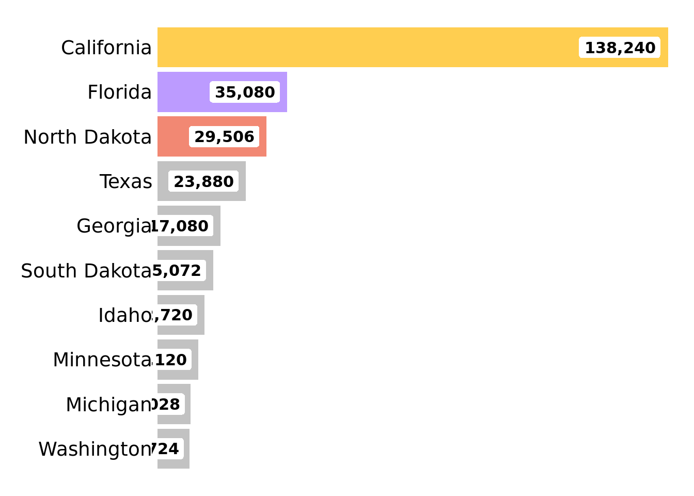

# Week 02: Bee Colonies

This files is for testing purposes

### 1.0 Load packages and data


```r
library(tidyverse)
```

```
## ── Attaching packages ─────────────────────────────────────── tidyverse 1.3.1 ──
```

```
## ✓ ggplot2 3.3.5     ✓ purrr   0.3.4
## ✓ tibble  3.1.6     ✓ dplyr   1.0.8
## ✓ tidyr   1.2.0     ✓ stringr 1.4.0
## ✓ readr   2.1.2     ✓ forcats 0.5.1
```

```
## ── Conflicts ────────────────────────────────────────── tidyverse_conflicts() ──
## x dplyr::filter() masks stats::filter()
## x dplyr::lag()    masks stats::lag()
```

```r
# Tidy Tuesday Load
df <- tidytuesdayR::tt_load(2022, week = 2)
```

```
## --- Compiling #TidyTuesday Information for 2022-01-11 ----
```

```
## --- There are 2 files available ---
```

```
## --- Starting Download ---
```

```
## 
## 	Downloading file 1 of 2: `colony.csv`
## 	Downloading file 2 of 2: `stressor.csv`
```

```
## --- Download complete ---
```

```r
# Store data sets
colony  <- df$colony
stressor <- df$stressor
rm(df)
```

### 2.0 Data Wrangling


```r
state_tbl <- colony %>%
    select(
        state,
        colony_lost
    ) %>%
    group_by(state) %>%
    summarise(
        bee_mean = mean(colony_lost, na.rm = TRUE)
    ) %>%
    arrange(-bee_mean) %>%
    filter(!str_detect(state, "United States")) %>%
    slice(1:10) %>%
    mutate(state = as_factor(state)) %>%
    mutate(state = fct_inorder(state)) %>%
    mutate(state = fct_rev(state)) %>%
    mutate(
        color = case_when(
            row_number() == 1 ~ "goldenrod1",
            row_number() == 2 ~ "mediumpurple1",
            row_number() == 3 ~ "coral2",
            ## all others should be gray
            TRUE ~ "gray70"
        )
    )
```

### 3.0 Plot


```r
state_tbl %>%
    ggplot(aes(x = bee_mean, y = state, fill = color)) +
    geom_col(
        position = position_dodge(0.7),
        alpha = 0.8
    ) +
    geom_label(aes(label = scales::comma(bee_mean)),
        hjust = 1.1, nudge_x = -0.5,
        size = 4, fontface = "bold", family = "Fira Sans",
        fill = "white", label.size = 0
    ) +
    scale_x_continuous(expand = c(.01, .01)) +
    scale_fill_identity(guide = "none") +
    theme_void() +
    theme(
        axis.text.y = element_text(size = 14, hjust = 1, family = "Fira Sans"),
        plot.margin = margin(rep(15, 4))
    )
```



### Save


